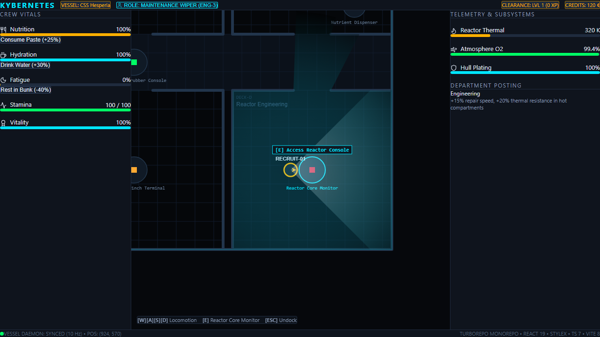

# Milestone 2: 2D Top-Down Viewport, WASD Locomotion, Dynamic Line of Sight, Role Manifest & Station Consoles

## Overview

Milestone 2 delivers the complete top-down 2D spatial simulation engine and interactive HUD layer for the Class-IV Bulk Ore Carrier *CSS Hesperia*. This release introduces real-time pawn locomotion, collision sliding, dynamic 2D Line of Sight (LoS) raycasting with directional flashlight cones, 5 starting crew roles with distinct survival traits, and interactive machinery docking consoles.

---

## Key Highlights & Package Breakdown

### 1. `@kybernetes/protocol`
- **Spatial Wire Primitives**: Added `WallSegment` (`x1, y1, x2, y2, isOpaque, thickness`), `DeckDefinition`, and `DutyDefinition` schemas.
- **Station Fixtures**: Extended `StationFixture` with optional contextual in-world interaction prompt strings (`prompt?: string`).
- **Broadcast Events**: Added `DutyCompletedBroadcast` for wire dispatch of duty completion, credit rewards, and clearance XP gains.

### 2. `@kybernetes/sim-core`
- **Starting Origin Roles (`roles.ts`)**:
  - `wiper` (Maintenance Wiper): Engineering, +15% repair speed, +20% thermal resistance in reactor bays.
  - `galley_hand` (Galley Hand): Sustenance & Logistics, -20% food/water consumption, +10% stamina aura.
  - `security_private` (Security Private): Armory & Defense, +25% combat efficiency, +15% baseline damage resistance.
  - `hydro_tender` (Hydroponics Tender): Biosphere & Life Support, +20% atmospheric scrubber speed, bio-toxin immunity.
  - `stevedore` (Cargo Stevedore): Hold Logistics & Salvage, +30% inventory carrying capacity, +15% scrap yield.
- **Ship Duty Engine (`duties.ts`)**:
  - Catalog of 8 department duties across reactor, mess, armory, hydroponics, and cargo stations.
  - Deterministic tick runner calculating stamina burn, role specialization boosts (1.5× speed), and starvation/dehydration penalties (halves work velocity per PRD 3.6).
- **CSS Hesperia Deck Geography (`spatial/deck.ts`)**:
  - Full deck plan: 7 compartments (Reactor Engineering, Galley/Mess, Armory, Hydroponics Bay, Cargo Hold, Bridge, Central Corridor).
  - 16 opaque bulkhead segments and 10 interactive machinery stations.
- **Physics & Wall Collision (`spatial/collision.ts`)**:
  - Circle-to-segment distance and penetration resolution.
  - Multi-axis tangent sliding algorithm (`resolvePawnMovement`) preventing pawn friction sticking along bulkhead surfaces.
- **Line of Sight & Fog of War (`spatial/visibility.ts`)**:
  - 2D Visibility Polygon raycasting using radial angular sorting of wall endpoints and ray-segment intersections.
  - Forward-facing directional flashlight cone (60° beam) blended with ambient room illumination.
- **Vitest Suite**: 17 unit tests verifying collision sliding, raycast occlusion, role matrices, and duty rewards.

### 3. `@kybernetes/web`
- **Hardware-Accelerated 2D Viewport (`VesselCanvas.tsx`)**:
  - HTML5 2D Canvas viewport tracking pawn movement with smooth camera interpolation.
  - Floor grid rendering, tactical compartment tags, bulkhead silhouettes, station interactive glyphs, and dynamic Line of Sight polygon clipping.
  - Responsive `ResizeObserver` maintaining a pixel-perfect 1:1 aspect ratio across all display resolutions.
- **Pawn Movement Controller (`usePawnMovement.ts`)**:
  - WASD and Arrow Key locomotion controller with normalized diagonal vectors and collision sliding.
  - Proximity detection engine notifying the HUD of nearest interactable stations.
- **Origin Manifest Modal (`RoleSelectModal.tsx`)**:
  - StyleX modal for selecting starting crew origins, displaying departmental postings, badges, and trait descriptions.
- **Station Docking Console (`StationConsoleModal.tsx`)**:
  - Interactive modal triggered by pressing `[E]` near fixtures.
  - Supports starting/aborting duties with real-time shift progress meters, bunk sleep cycles for stamina regeneration, and nutrient paste / water recycling dispensers.
- **Compile-Time StyleX Integration**:
  - Added `@stylex stylesheet;` integration to `index.css`, generating 4.54 kB of compile-time CSS rules and design tokens with zero runtime overhead.
- **End-to-End Verification (`e2e/milestone2.spec.ts`)**:
  - Comprehensive Playwright tests covering WASD movement coordinates, role manifest switching, station proximity prompt detection, and duty execution.
