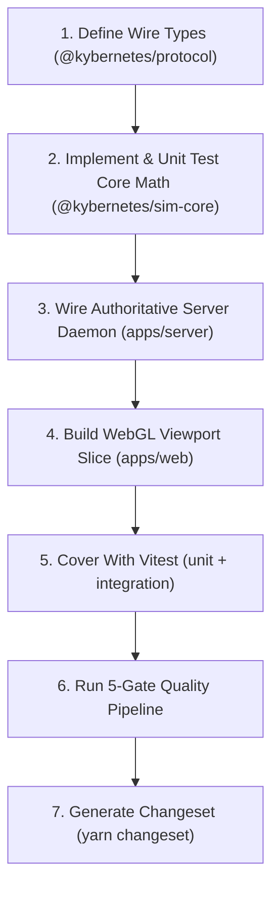

# AGENTS.md — Kybernetes Engineering Handbook & Work Routine

Welcome to **Kybernetes** (*Κυβερνήτης*). This document defines the architectural standards, development workflow, and automated quality gates that all agents and developers must adhere to when modifying or extending this codebase.

---

## 1. Project Philosophy & Stack Pillars

1. **Zero-DOM Core Simulation**:
   * All game rules, physics, reactor math, survival vitals decay, 2D collisions, and combat mitigation reside in `packages/sim-core`.
   * `packages/sim-core` must remain **100% pure TypeScript** with **0 DOM dependencies** so it runs identically on server and client.
2. **Authoritative Server, Optimistic Client**:
   * `apps/server` is authoritative over ship physics, inventory, survival rates, and combat damage.
   * `apps/web` renders the 2D Canvas viewport and StyleX HUD, performing client-side movement prediction and station docking.
3. **Strict Wire Contracts**:
   * All client actions and server broadcasts must be strictly typed in `packages/protocol`. Never send untyped JSON over WebSockets.
4. **Compile-Time Styling**:
   * Use **Meta StyleX** (`@stylexjs/stylex`) with tokens from `@kybernetes/ui-tokens`.
   * **Never introduce Tailwind CSS or runtime CSS-in-JS libraries.**

---

## 2. The Standard Development Work Routine

When implementing any feature, bug fix, or milestone task, follow this exact routine in order:



Playwright e2e is NOT an agent gate: it is slow, stateful, and flaky by
nature. Agents prove behavior with Vitest (pure unit plus host/daemon
integration that runs the real tick loop and sockets). Playwright exists to
produce screenshots and videos for HUMAN verification — run it on demand
(`yarn --cwd apps/web playwright test harbor-scenes.spec.ts`), never as a
commit gate. CI keeps running the browser suite as the human signal.

### Step 1: Protocol First (`packages/protocol`)
* Add or update client action intents (`ClientAction`) and server broadcasts (`ServerBroadcast`).
* Ensure discriminant union tags (`type: '...'`) are explicit and all fields are strongly typed.

### Step 2: Simulation Core & Vitest (`packages/sim-core`)
* Implement pure math and state update functions in `src/`.
* Write parallel Vitest unit tests in `src/*.test.ts`. Test boundary cases (e.g., zero oxygen, starving vitals, reactor overheat).

### Step 3: Authoritative Server Handler (`apps/server`)
* Ingest validated intents in `SimHost.handleIntent()` via the intent router.
* Ensure state updates are replicated in the ticked v2 channels (SNAPSHOT 10Hz, TELEMETRY 2Hz, VITALS 5Hz).
* Cover the loop with host/daemon integration tests (real ticks, real sockets); see `apps/server/src/*test.ts`.
* Maintain clean process lifecycle: ensure `stop()` terminates open client sockets and closes `WebSocketServer`.

### Step 4: Web Viewport Slice (`apps/web`)
* Drive the WebGL renderer from v2 snapshots through `harbor/` adapters; the
  renderer, passes, and models under `apps/web/src/webgl/` are editable — the
  rework freeze is lifted, so fix render leftover mistakes at their source.
* Keep all translation logic pure and unit-tested (see `harbor/renderState.ts`).

### Step 5: Cover With Vitest (unit + integration)
* Prove behavior where it lives: kernel math in `packages/sim-core`, host/daemon loops in `apps/server`, pure adapters in `apps/web/src`.
* Do NOT add Playwright assertions as the primary proof for logic that Vitest can cover.

### Step 6: 5-Gate Quality Pipeline (Mandatory before committing)
Run the following verification suite:
```bash
# 1. Formatting and linting (Biome, touched files)
yarn lint

# 2. Dead code, clones, and structural health (Fallow)
yarn quality

# 3. TypeScript 7 strict compiler check
yarn typecheck

# 4. Vitest unit + integration tests
yarn test

# 5. Turborepo production build
yarn build
```

Playwright is not a gate. To produce human-verification artifacts on demand:
```bash
yarn --cwd apps/web build

yarn --cwd apps/web playwright test harbor-scenes.spec.ts # screenshots
```
Screenshots land in `apps/web/test-results/` (gitignored); failure videos are retained automatically (see `playwright.config.ts`).

### Step 7: Changeset
If you touched any packages (`@kybernetes/*`), generate a changeset entry:
```bash
yarn changeset
```

---

## 3. Critical Caveats & Rules of Thumb

### StyleX Rules
- **No Dynamic Values in `stylex.create()`**: Only static CSS values and design tokens (`hudColors.*`) are allowed.
  * ❌ *Forbidden*: `progressBarFill: (percent) => ({ width: `${percent}%` })`
  * ✅ *Allowed*: Static `progressBarFill: { height: '100%', transition: 'width 0.2s ease' }` and dynamic `style={{ width: `${percent}%` }}` in JSX.
- **Importing Tokens**: Always import tokens from the `.stylex` file directly:
  * ✅ `import { hudColors } from '@kybernetes/ui-tokens/tokens.stylex';`
  * ❌ Do not import tokens from a barrel file (`@kybernetes/ui-tokens`) inside components, as Babel cannot track `defineVars`.

### Server Port Teardown
- On Windows, always ensure `server.stop()` is called and active WebSockets are terminated (`client.terminate()`) before closing `wss`.
- Never leave orphan Node processes bound to port 3001. Trapping `SIGINT` and `SIGTERM` in `apps/server/src/index.ts` is required.

### Fallow Quality Constraints
- `fallow` scans for:
  1. **Unused class members and exports**: Do not add dead methods to classes.
  2. **High cyclomatic / cognitive complexity**: Keep methods under 20 lines and break complex control flows into helper functions.
  3. **Duplicate code blocks**: Shared utility logic belongs in `packages/sim-core` or shared packages.

### Biome Conventions
- Use `node:path`, `node:fs`, `node:crypto` prefix for all Node built-in imports.
- Run `yarn lint:fix` to auto-sort imports and format before running checks.

### HUD & Visor Layout Invariants
- **Dynamic Visor Margins**: Never place HUD cards or modal overlays at fixed vertical coordinates (e.g. `y = 80`). Always offset from calculated screen margins (`marginY = Math.max(38, Math.round(height * 0.055))`) and account for top visor height (`marginY + 68` for a 14px gap below the 54px header).
- **Monospace Text Budgeting**: For 2D canvas/WebGL monospace text, budget $\approx 7.2\text{px}$ per character at 12px font size. Always ensure `string.length * charWidth <= panelWidth - 2 * padding` or truncate/wrap dynamically to prevent text overflowing card boundaries.
- **HUD Renderer Modularization**: To comply with Fallow cognitive complexity limits, never inline complex role/status formatting or geometric hit-testing inside `HudRenderer` methods; isolate them in pure helper modules.
