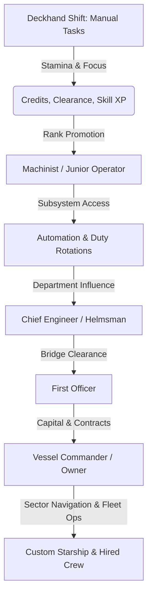
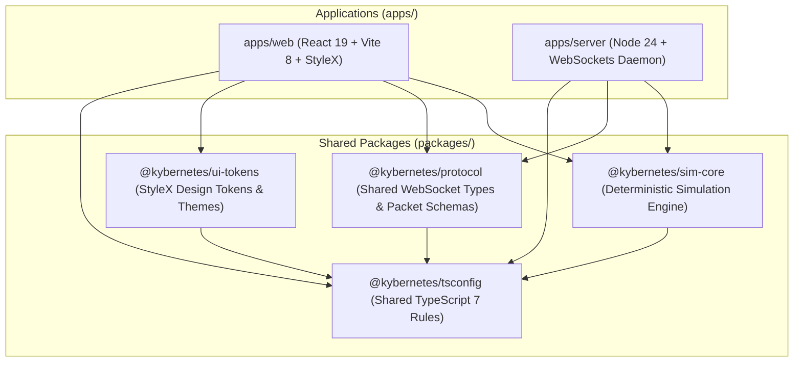

# Product Requirements Document (PRD)

## Project Name: **Kybernetes** (*Working Title*)

---

## 1. Executive Summary & Vision

**Kybernetes** is a semi-idle space simulation and incremental management game focused on the intimate, operational life aboard a single starship. 

Unlike traditional abstract 4X empire builders or text-only incremental games, the game world is rendered in an atmospheric **2D top-down view**. Players physically control their character pawn using **WASD movement**, exploring the cramped, clanking interior of an aging deep-space hauler—as a grease-stained **Maintenance Wiper**, a sweat-drenched **Galley Hand**, a low-ranking **Security Private**, a biosuit-clad **Hydroponics Tender**, or a heavy-lifting **Cargo Stevedore**. Through physical corridor navigation, tactile station interaction (`[E]`), survival vigilance, and departmental mastery, the player climbs the chain of command to buy out, commission, and command their own starship.

**2D Top-Down Spatial Presence & Multiplayer Co-Op**: Players can crew the **same vessel together** in real time or asynchronously. You see other crew members' pawns physically walking through corridors, running to battle stations, and operating consoles in the 2D world. One player works the reactor consoles in the lower engineering bay, another chops rations at the galley mess table, while a security marine patrols airlocks and engages hostile boarders in corridor firefights.

**Survival & Combat**: Space is cold and unforgiving. Players must maintain personal vitals (**Hunger, Thirst, Fatigue**) by walking to the mess hall, hydration fountains, and personal bunks. Later, as commanders, they oversee macro logistics for the entire crew. Threat arrives through external **Ship Damage Events** (torpedo strikes, solar flares, hull breaches) and internal **Hostile Boarding Actions** where raiders breach the hull in real-time 2D top-down combat, requiring crew to seal bulkheads, vent compartments, or engage in close-quarters skirmishes.

---

## 2. Core Pillars

1. **2D Top-Down Spatial World & WASD Pawn Control**:
   - The vessel is a tangible, multi-deck 2D environment with bulkheads, airlocks, conduits, consoles, and bunks.
   - Smooth, responsive WASD avatar control with physical collision, dynamic 2D **Line of Sight (LoS)**, and multi-tier **Fog of War (FoW)**.
   - Visually atmospheric: flashlight cones, corridor shadow casting, blackout emergency lighting, and tactile interaction zones (`[E] Interact`).
   - Seamlessly pairs tactile 2D spatial movement with deep, semi-idle station simulations and reactive StyleX HUD overlays.

2. **Grounded Human Scale $\rightarrow$ Grand Fleet Mastery**:
   - Choose your origin at the bottom rung: Maintenance Wiper, Galley Hand, Security Private, Hydro Tender, or Stevedore.
   - Every credit, clearance badge, and promotion feels earned.
   - Progression scales from individual survival and manual shift labor up to capital ship ownership, crew logistics, and naval command.

3. **Personal Survival & Macro Crew Sustenance**:
   - Early Game: Balance personal vitals—**Hunger** (rations/paste), **Hydration** (water recycling), and **Fatigue** (bunk sleep cycles). Physically walk to mess halls or bunks to rest and recharge. Failing to sustain yourself causes exhaustion and critical task failure.
   - Command Game: Manage vessel-wide consumables (hydroponics yields, protein synthesizers, greywater filtration, crew quarters, and morale). Neglect risks crew starvation, strikes, and mutiny.

4. **Dynamic Naval Damage & 2D Top-Down Boarding Combat**:
   - **Ship Damage Events**: Hostile missile runs, railgun volleys, and micrometeor storms inflict subsystem failures, atmospheric leaks, and reactor fires that demand immediate crew triage in the damaged compartments.
   - **Internal Boarding Events**: Pirates and rival corporate operatives breach the hull. Maneuver your pawn in 2D space, man security checkpoints, manually crank blast door bulkheads shut, vent compromised compartments, or deploy automated defense turrets.

5. **Crew Co-Op & Shared Vessel Co-Presence**:
   - Multiple players inhabit and operate the **exact same vessel** simultaneously or asynchronously.
   - Live spatial co-presence: see crewmates' pawns walking between decks, carrying tools, operating consoles, or sleeping in bunks.
   - Shared ship state (Reactor, O2, Hull, Cargo, Navigation) paired with distinct individual player progression (Vitals, Stamina, Credits, Rank, Clearance, Tools).
   - Asynchronous shift handovers: players leave logbook reports and assign automated watch rotations for offline crewmates.

6. **Decoupled Simulation Engine**:
   - The core game loop runs in a deterministic, pure TypeScript engine with fixed-step delta-time ticks.
   - Completely independent from the rendering layer, making it testable via headless unit tests and portable across client and authoritative server.
   - Robust offline time catch-up simulation with configurable efficiency caps.

7. **Tactical Sci-Fi HUD & Diegetic Telemetry**:
   - Visual identity inspired by *The Expanse*, *Alien (Nostromo)*, and modern aerospace telemetry.
   - High-contrast dark themes, amber/cyan/emerald phosphor indicators, mono typography, real-time subsystem gauges, and auto-scrolling vessel logs overlaying the 2D viewport.

8. **Modern, Strict Tech Stack & Monorepo Architecture**:
   - **Monorepo Engine**: **Turborepo** (`turbo`) orchestrating parallel build, dev, test, and typecheck tasks across Yarn Berry workspaces with intelligent caching.
   - **Package Manager**: Yarn Berry (v4.x) Workspaces configured with `nodeLinker: node-modules`.
   - **Runtime**: Node.js v24 (Latest).
   - **Language**: TypeScript 7 with strict type checking across all workspace packages.
   - **Bundler / Dev Server**: Vite 8.
   - **UI & 2D Rendering**: React 19 + HTML5 2D Canvas Viewport + **StyleX** (`@stylexjs/stylex`) for diegetic HUD chrome and overlay interfaces.
   - **Networking**: High-performance WebSocket architecture (`ws` / Node 24 native WebSockets) for real-time shipboard telemetry, spatial position replication, and state synchronization.
   - **Testing Suite**:
     - **Vitest**: Parallel unit testing across packages for simulation tick runner, physics formulas, and protocol serialization.
     - **Playwright**: End-to-end multi-user browser testing (multi-context tests simulating concurrent players on the same vessel), UI automation, and visual regression testing.

---

## 3. Game Loop & Progression Model



### 3.1. Phase I: Starting at the Keel — Entry-Level Roles
- **Vessel**: *CSS Hesperia* (Class-IV Bulk Ore Carrier).
- **Rank**: Grade 3 Recruit (Lowest departmental rung).
- **Starting Role Selection**: Players choose their departmental origin, each with unique starting stations, initial shift duties, and passive traits:
  1. **Maintenance Wiper** (Engineering):
     - *Starting Station*: Deck D Bilges & Reactor Conduits.
     - *Duties*: Scrub plasma grids, purge coolant lines, weld micro-stress fractures.
     - *Trait*: +15% repair speed, +20% thermal resistance in hot compartments.
  2. **Galley Hand** (Sustenance & Logistics):
     - *Starting Station*: Deck B Mess Hall & Cold Storage.
     - *Duties*: Mix synthetic protein batches, brew recaf, wash grease traps, distribute ration tins.
     - *Trait*: -20% personal food/water consumption rate, +10% stamina recovery aura to nearby crewmates.
  3. **Security Private / Marine Recruit** (Ship Defense & Armory):
     - *Starting Station*: Deck C Armory & Airlock Checkpoints.
     - *Duties*: Sentry watch, clean point-defense ammo chutes, inventory riot gear, drill combat maneuvers.
     - *Trait*: +25% combat efficiency, +15% baseline damage resistance against boarders.
  4. **Hydroponics Tender** (Biosphere & Life Support):
     - *Starting Station*: Deck B Bio-Dome & Scrubber Bays.
     - *Duties*: Tend spirulina algae vats, calibrate CO2 scrubbers, harvest synth-produce, clear fungal rot.
     - *Trait*: +20% atmospheric scrubber efficiency, immune to low-grade bio-toxins.
  5. **Cargo Stevedore** (Hold Logistics & Salvage):
     - *Starting Station*: Deck C Main Cargo Hold & Ore Bay.
     - *Duties*: Operate manual mag-winches, strap down heavy containers, sort raw slag, salvage metal scrap.
     - *Trait*: +30% inventory carry capacity, +15% bonus scrap yield from salvage.

### 3.2. Phase II: Automation & Systems Operator (Mid Game)
- **Rank**: Maintenance Lead $\rightarrow$ Junior Systems Operator $\rightarrow$ Machinist Mate.
- **Unlocked Mechanics**:
  - Install subroutines, macro loops, and servo-assist tools to automate repetitive deck tasks.
  - Balance shipboard telemetry: Reactor Core Temp, O2 Scrubber efficiency, Grav-Plate stability, Hull Stress.
  - Random dynamic events: Solar storm radiation surges, micro-meteoroid punctures, coolant valve blowouts.
  - "Bribe, barter, or impress": Interact with senior officers, quartermasters, and union delegates to gain clearance codes and illicit blueprints.

### 3.3. Phase III: The Bridge & Command (Late Mid Game)
- **Rank**: Chief Engineer $\rightarrow$ Helmsman $\rightarrow$ First Officer.
- **Unlocked Mechanics**:
  - Bridge duty shifts: sub-light navigation, jump calculations, docking procedures, trade manifest signing.
  - Manage subordinate crew shifts and department allocations (Engineering, Life Support, Logistics, Security).
  - High-value salvage contracts, derelict exploration, black-market cargo diversion.

### 3.4. Phase IV: Vessel Commander (End Game / Prestige)
- **Rank**: Captain / Ship Owner.
- **Unlocked Mechanics**:
  - Purchase or salvage a personal starship (choice of hull archetypes: Deep-Range Scout, Heavy Hauler, Fast Courier, Gunboat).
  - Modular ship outfitting: Reactor types, engine drives, crew quarters, sensor arrays, defense turrets.
  - Hire crew (recruit deckhands, engineers, and pilots) and assign them to the very duties the player once performed.
  - Route planning across star systems, faction reputation, trade arbitrage, and long-range expeditions.

### 3.5. Multiplayer Crew Mechanics & Co-Op Dynamics
- **Crew Roster & Station Allocation**:
  - A vessel supports 1 to 8 concurrent crew members (scalable up to full guild/clan vessels in future expansions).
  - Players occupy real stations across ship decks (e.g. Player A in Engine Room B3, Player B in Life Support Bay, Player C on Bridge Navigation).
  - Station presence grants efficiency bonuses to related duties (e.g., being physically stationed in the Engineering bay speeds up coolant line flushes by 25%).
- **Co-operative Duties & Team Mechanics**:
  - **Collaborative Heavy Shifts**: Tasks requiring high cumulative labor (e.g. *Main Thruster Overhaul*, *Smelting Ingot Batch*). Multiple players can contribute stamina simultaneously, cutting cycle times drastically.
  - **Dual-Operator Critical Protocols**: High-stakes operations requiring simultaneous actions from two different decks (e.g., Engineering primes the FTL reactor core while the Bridge aligns the jump drive within a 10-second synchronization window).
  - **Emergency Crisis Triage**: Unpredictable catastrophes (e.g. micrometeoroid puncturing Deck C, or coolant line rupture) require split-second teamwork: one player seals compartment blast doors, another vents the toxic atmosphere, and a third re-routes auxiliary power.
- **Shared vs. Personal Economics**:
  - **Vessel Operating Ledger (Ship Treasury)**: Communal pool funded by mission payouts, trade deliveries, and cargo sales. Used for fuel, hull plating repairs, engine overhauls, and ship upgrades.
  - **Personal Crew Compensation**: Individual salaries, hazard pay, and scrip earned per shift. Spent on personal gear, skill certifications, cybernetic enhancements, and private savings toward purchasing one's own ship.
  - **Work Orders & Bounties System**: Senior officers and captains can post high-bounty work orders to the ship's internal bulletin board (*"Need urgent coolant filter overhaul: +200 personal credits bounty from ship fund"*), incentivizing junior deckhands to take on crucial maintenance.
- **Asynchronous & Synchronous Co-existence**:
  - **Live Co-presence**: See real-time activity indicators of crewmates working on systems, stamina usage, and live chatter.
  - **Shift Handovers & Night Watches**: Players who log off can set "Standing Orders" or "Automation Shifts" that run at calculated offline rates. Online crewmates can read past shift logs, inspect maintenance reports left in the ship terminal, and take over the watch.

### 3.6. Survival Mechanics & Crew Sustenance Logistics
- **Personal Vitals (Individual Level)**:
  - **Nutrition (Hunger 0–100%)**: Depletes steadily and accelerates during physical shifts. Consuming synthetic nutrient paste, mess rations, or fresh produce restores stamina replenishment rates. Starvation (<20%) caps max stamina at 50% and slows work cycle speeds by half.
  - **Hydration (Thirst 0–100%)**: Depletes quickly during high-heat engineering tasks or combat exertion. Drinking recycled station water or purified reservoir reserves maintains mental focus. Severe dehydration (<20%) causes disorientation and doubles critical tool failure chances.
  - **Rest & Sleep (Fatigue 0–100%)**: Accumulated through prolonged awake shifts. Sleeping in assigned crew bunks discharges fatigue, accelerates health regeneration, and removes exhaustion debuffs. Prolonged sleep deprivation incurs hallucination events and dangerous miscalculations.
- **Macro Crew Sustenance & Life Support (Command Level)**:
  - When commanding a vessel or heading a department, the player oversees shipwide consumable stockpiles:
    - **Food Stockpiles**: Synthetic protein tanks, dehydrated ration crates, and greenhouse yields.
    - **Water Reservoirs**: Greywater recycling efficiency, condensate collectors, and filtration filters.
    - **Atmospheric Quality**: O2 balance, CO2 scrubbers, and nitrogen pressurization.
  - **Crew Morale & Mutiny Index**: If rations are rationed too strictly, water recycling breaks down, or bunks are overcrowded, crew morale plummets. Low morale induces work slowdowns, union grievances, sabotage, and full-scale mutiny.

### 3.7. Combat Operations: Damage Events & Boarding Actions
- **External Damage Events (Naval Warfare & Space Hazards)**:
  - Ship encounters hostile pirate gunboats, corporate patrol cruisers, minefields, or high-density micrometeor swarms.
  - **Battle Stations Red Alert**:
    - Hull integrity, thermal shield barriers, and kinetic deflection plating absorb incoming fire.
    - Subsystem impacts: Torpedo hits cause localized hull breaches, reactor thermal runaways, and severed electrical conduits.
    - **Crew Battle Roles**:
      - Man Point-Defense Turrets (PDT) to intercept incoming torpedoes and fighter drones.
      - Deploy fire suppression foam into burning compartments.
      - Conduct emergency spacewalk repairs (EVA hull patching) under orbital fire.
- **Internal Boarding Events (Close-Quarters Repel & Breach Defense)**:
  - Enemy boarding pods drill directly into vulnerable hull sections (airlocks, cargo bays, or maintenance vents).
  - **Tactical Compartment Control**:
    - **Bulkhead Lockdown**: Seal heavy blast doors via security console or manual deck wheel to trap boarder squads.
    - **Atmospheric Depressurization**: Vent oxygen into the void from compromised compartments to suffocate raiders lacking environmental suits (risking ship cargo and equipment).
    - **Corridor Skirmishes**: Marines and crew take defensive cover behind bulkhead bulkheads, utilizing slugthrowers, shock mauls, arc-welding torches, and deployed automated sentry guns.
    - **Sabotage Mitigation**: Enemy boarders actively seek to plant shaped charges on the reactor core, loot the corporate safe, or take the bridge. Crew must neutralize them before the timer expires.

### 3.8. 2D Top-Down World, WASD Movement & Spatial Interaction
- **Top-Down 2D Vessel Geometry**:
  - The starship is rendered as an atmospheric 2D top-down floor plan spanning multiple interconnected decks (Bridge, Crew Quarters, Mess Hall, Hydroponics Bay, Cargo Bay, Bilges & Reactor Conduits, Airlocks).
  - Spatial features: Walkable deck plating, solid bulkhead walls, operable blast doors/airlocks, deck ladders/grav-lifts, and hazardous conduits (superheated steam vents, sparking wires).
- **Player Pawn & WASD Locomotion**:
  - **Movement**: Smooth, responsive WASD avatar control with diagonal speed normalization and physical wall/door collision.
  - **Camera System**: Dynamic 2D camera smoothly tracking the player pawn with subtle directional look-ahead.
  - **Interaction Prompts (`[E]` Key)**: Proximity detection highlights interactive stations, bunks, dispensers, and bulkheads with contextual in-world prompts (*`[E] Access Reactor Console`*, *`[E] Rest in Bunk`*, *`[E] Dispense Nutrient Paste`*, *`[E] Crank Bulkhead Lock`*).
  - **Station Docking & Semi-Idle Synergy**:
    - Pressing `[E]` at a station physically locks/docks the pawn into an "operating" animation and slides open the detailed tactical StyleX work console.
    - Players can initiate manual shifts, activate automation routines, and either stay docked or walk away to attend to other emergencies while background shifts continue.
- **Line of Sight & Environmental Ambiance**:
  - Dynamic 2D raycast Line of Sight: vision is blocked by closed blast doors and bulkhead corners, casting authentic sci-fi shadows across corridors.
  - Compartment states are rendered visually in 2D: decompressed rooms display venting fog and flying debris; fire hazards emit orange glows and smoke; battle stations trigger flashing amber/red emergency klaxon lighting.
- **Multiplayer 2D Spatial Presence**:
  - Real-time interpolated pawn movement for all connected crew members with floating callsign/rank tags, departmental color bands, and status animations (walking, welding, operating, sleeping, shooting).

### 3.9. Fog of War, Line of Sight & Lighting Architecture
- **2D Line of Sight (LoS) Raycasting**:
  - Exact 2D Visibility Polygon algorithm cast from the player pawn's position against all structural line segments (bulkhead walls, solid machinery, closed blast doors).
  - **Occluder Types**:
    - *Opaque Occluders*: Solid hull plating, structural pillars, closed security blast doors (block both physical movement and vision rays).
    - *Transparent Occluders*: Reinforced plasteel viewing ports and glass airlock windows (block movement and atmospheric pressure, but allow full Line of Sight).
    - *Dynamic Portals*: Open doors and retracted blast gates allow vision rays to seamlessly penetrate into adjacent compartments.
  - **Lighting Cones & Vision Modes**:
    - *Radial Ambient Vision*: Short-range 360° awareness (3–4 meters) around the pawn for immediate surroundings.
    - *Directional Flashlight / Headlamp*: High-intensity 90° forward vision cone (15–20 meters) following the pawn's facing direction.
    - *Power Blackout States*: When ship auxiliary power fails or conduits sever, ceiling illumination cuts out. Ambient vision drops to near-zero, forcing reliance on the flashlight beam and faint emergency exit strips.
- **Three-Tier Fog of War (FoW)**:
  1. **Direct Visibility (Active LoS)**:
     - Full-color rendering of floor tiles, equipment, dynamic hazard particles (fires, coolant mist, sparks), and real-time pawns (fellow crewmates and hostile boarding intruders).
  2. **Explored Memory (In the Fog)**:
     - Ship compartments previously explored by the player retain their structural layout in a desaturated, darkened monochrome memory buffer.
     - Dynamic elements are completely concealed: moving raiders, active hull breaches, and spreading fires cannot be seen unless brought back into active LoS or detected by shipboard telemetry.
  3. **Unexplored Void (Pitch Black)**:
     - Unmapped decks, alien derelict sectors, or unaccessed maintenance crawlspaces remain in complete darkness until physically navigated.
- **Sensor Fusion & Shipboard Surveillance**:
  - **Security Camera Cones (CCTV)**: Terminals on the Bridge or in the Security Armory project static visibility polygons into monitored corridors, piercing the Fog of War.
  - **Crew IFF Transponders**: Active crew members emit digital transponder pings on the HUD radar, allowing teammates to track each other's approximate compartment positions through the fog.
  - **Motion Sensors**: Tactical Marines can deploy or monitor ultrasonic motion detectors that display pulsating warning blips through FoW when boarders advance down unlit corridors.

---

## 4. Architecture & Monorepo Package Decomposition

The codebase is organized as a high-performance **Turborepo monorepo** managed with Yarn Berry workspaces. This ensures strict decoupling between deterministic game physics, network protocol definitions, design tokens, server daemons, and frontend HUD applications.



### 4.1. Workspace Structure & Package Responsibilities

#### **`apps/web`** (Tactical Sci-Fi HUD Client & 2D Top-Down Viewport)
- **Tech Stack**: React 19, Vite 8, HTML5 2D Canvas, `@stylexjs/stylex`, `lucide-react`, Playwright.
- **Role**: Renders the 2D top-down starship gameworld, handles WASD avatar control, and layers diegetic StyleX HUD chrome and station consoles over the canvas viewport.
- **Key Modules**:
  - `VesselCanvas`: High-performance 2D Canvas rendering the ship floor plan, bulkhead walls, interactive consoles, dynamic hazard effects (fire, decompression fog), and crew/intruder pawn sprites.
  - `VisibilityRenderer`: Computes real-time 2D visibility polygons from occluder segments, renders directional flashlight cones and ambient falloff, applies composite masking for 3-tier Fog of War, and maintains the explored memory layer.
  - `MovementController`: Responsive WASD keyboard input handler with client-side prediction, collision sliding, and proximity interaction binding (`[E] Interact`).
  - `Camera2D`: Smooth tracking camera centered on the player pawn with look-ahead offset and zoom controls.
  - `VitalsHUD`: Personal status meters (Hunger, Thirst, Fatigue), quick-ration injectors, hydration flasks, and bunk rest triggers.
  - `TelemetryPanel`: Real-time subsystem gauges, thermal load indicators, and warning sirens.
  - `DutyConsole`: Available station jobs, active shift progress gauges, and stamina recovery bunks.
  - `VesselDeckMap`: Multi-deck interactive map with compartment atmosphere status, intruder presence, and manual bulkhead lockdown/vent controls.
  - `BattleStationsHUD`: Emergency Red Alert overlay, Point-Defense manual tracking, fire suppression controls, and combat casualty triage.
  - `CommsConsole`: Live text stream of ship events, ambient crew chatter, and formal announcements.
  - `CrewManifest`: Live list of onboard crewmates, active stations, personal status (stamina/working), and direct text/ping channels.
- **Dependencies**: `@kybernetes/sim-core`, `@kybernetes/protocol`, `@kybernetes/ui-tokens`.

#### **`apps/server`** (Authoritative Vessel Session Daemon)
- **Tech Stack**: Node.js 24, `ws` (WebSockets), Vitest.
- **Role**: Hosts multiplayer vessel sessions, runs authoritative tick loop, enforces physics/maintenance math, validates player actions, manages lobby Beacon Codes, streams delta packets.
- **Key Modules**:
  - `VesselSession`: Manages active ship instances, tick loop, and persistent vessel state.
  - `SpatialManager`: Authoritative 2D pawn position tracking, boundary/bulkhead collision validation, and 15Hz–20Hz spatial snapshot broadcasting to connected crew.
  - `SurvivalManager`: Tracks individual crew hunger/thirst/sleep decay, shipwide food/water reserves, and mutiny index.
  - `CombatManager`: Generates naval hazard/skirmish events, handles torpedo impacts, orchestrates enemy boarding pods, and simulates intruder squad movement across compartments.
  - `LobbyManager`: Creates and joins vessel sessions via 6-character Beacon Codes.
  - `ClientConnection`: Handles WebSocket transport, heartbeat/ping-pong, authentication, and packet routing.
- **Dependencies**: `@kybernetes/sim-core`, `@kybernetes/protocol`.

#### **`packages/sim-core`** (`@kybernetes/sim-core`)
- **Tech Stack**: TypeScript 7, Vitest (Pure TypeScript, 0 DOM dependencies).
- **Role**:
  - Deterministic game loop runner with fixed-step delta-time.
  - **`spatial/`**:
    - `tilemap.ts`: 2D deck grid definitions, wall segments, door frames, and interactable console coordinates.
    - `collision.ts`: AABB and polygon collision detection and slide response.
    - `visibility.ts`: 2D Visibility Polygon algorithm, ray-segment intersections, and Fog-of-War bitmask exploration grids.
  - **`survivalEngine.ts`**: Hunger/thirst depletion rates, stamina regen curves, sleep deprivation debuffs, and macro crew consumption formulas.
  - **`combatEngine.ts`**: Subsystem damage mitigation, armor degradation, Point-Defense Turret intercept probabilities, and fire spread mechanics.
  - **`boardingEngine.ts`**: Intruder breach pathfinding, bulkhead pressure differentials, atmospheric venting asphyxiation math, and CQB combat resolution.
  - **`roles.ts`**: Starting role definitions (Wiper, Galley Hand, Marine, Hydro Tender, Stevedore), initial perks, and departmental skill matrices.
  - Thermal dissipation, atmospheric scrub decay, reactor power distribution, and hull stress formulas.
  - Duty managers, stamina exhaustion/recovery curves, and automation scheduler.
  - Offline time progression catch-up calculation with configurable safety caps.
  - Save serialization, deserialization, checksum verification, and schema version migrations.
- **Reusability**: Runs headlessly on the server for multiplayer authority and in-browser on the client for single-player/offline mode and optimistic client prediction.

#### **`packages/protocol`** (`@kybernetes/protocol`)
- **Tech Stack**: TypeScript 7.
- **Role**:
  - Strongly typed WebSocket packet definitions:
    - *Client Intents*: `PlayerMoveIntent`, `InteractStationIntent`, `StartDutyAction`, `CancelDutyAction`, `TransferDeckAction`, `ConsumeItemAction`, `BunkSleepAction`, `ToggleBattleStationsAction`, `BulkheadLockAction`, `VentCompartmentAction`, `EngageBoarderAction`.
    - *Server Broadcasts*: `SpatialSnapshotBroadcast`, `TelemetryDeltaBroadcast`, `VitalsDeltaBroadcast`, `CrewManifestUpdate`, `ShipAlertBroadcast`, `IntruderBreachBroadcast`, `CombatDamageEventBroadcast`, `DutyCompletedEvent`.
  - Beacon Code handshake protocol and session error codes.
  - Shared validation logic for action payloads.

#### **`packages/ui-tokens`** (`@kybernetes/ui-tokens`)
- **Tech Stack**: `@stylexjs/stylex`, TypeScript 7.
- **Role**:
  - Centralized StyleX theme variables: tactical phosphor green, telemetry amber, deep void background, panel border shades.
  - Common animations: CRT scanlines, alarm pulse animations, telemetry gauge transitions.
  - Reusable StyleX utility styles and typography tokens.

#### **`packages/tsconfig`** (`@kybernetes/tsconfig`)
- Centralized TypeScript 7 configurations (`base.json`, `react.json`, `node.json`).

---

### 4.2. Turborepo Pipeline Specification (`turbo.json`)

```json
{
  "$schema": "https://turbo.build/schema.json",
  "tasks": {
    "build": {
      "dependsOn": ["^build"],
      "outputs": ["dist/**", ".stylex/**"]
    },
    "dev": {
      "cache": false,
      "persistent": true
    },
    "test": {
      "dependsOn": ["^build"],
      "outputs": ["coverage/**"]
    },
    "test:e2e": {
      "dependsOn": ["build"],
      "cache": false
    },
    "lint": {
      "dependsOn": ["^build"]
    },
    "typecheck": {
      "dependsOn": ["^build"]
    }
  }
}
```

- **Parallel Execution**: Independent packages build, test, and typecheck concurrently.
- **Root Scripts**:
  - `yarn build` $\rightarrow$ `turbo run build`
  - `yarn dev` $\rightarrow$ `turbo run dev` (starts `web` and `server` in parallel)
  - `yarn test` $\rightarrow$ `turbo run test` (executes Vitest in parallel across packages)
  - `yarn test:e2e` $\rightarrow$ `turbo run test:e2e` (runs multi-context Playwright tests)
  - `yarn typecheck` $\rightarrow$ `turbo run typecheck`

---

## 5. Technical Stack & Tooling Specification

| Component | Choice | Rationale |
| :--- | :--- | :--- |
| **Monorepo Engine** | **Turborepo** (`turbo` v2.x) | High-performance task orchestration with intelligent caching for parallel build, test, and lint execution. |
| **Package Manager** | Yarn Berry v4.x Workspaces | Fast, deterministic dependency management with `nodeLinker: node-modules` and workspace protocol (`workspace:*`). |
| **Runtime** | Node.js v24.x | Latest runtime with native WebSockets, ESM performance, and modern features. |
| **Language** | TypeScript 7 | End-to-end strict typing across apps and shared packages via composite project references. |
| **Bundler / Dev Server** | Vite 8 | Instant HMR, native ES modules, lightweight production rollup for `apps/web`. |
| **UI Framework** | React 19 | Standard reactive UI, declarative component architecture. |
| **2D Rendering Engine** | HTML5 2D Canvas (Context2D) | High-performance, hardware-accelerated 2D top-down floor plan rendering, dynamic 2D raycast Line of Sight (LoS), 3-tier Fog of War (FoW) masking, flashlight penumbra cones, and pawn sprite interpolation. |
| **Styling** | **StyleX** (`@stylexjs/stylex`) | Meta's compiler-driven atomic CSS-in-JS; typed styles, no collision, zero runtime cost for HUD overlays. |
| **Vite StyleX Plugin** | `vite-plugin-stylex` | Seamless compilation of StyleX rules during Vite dev and production builds. |
| **Icons** | `lucide-react` | Crisp, scalable iconography for HUD gauges, statuses, and navigation. |
| **Networking / WebSockets** | `ws` (Node.js 24) | High-throughput, low-latency WebSocket server managing vessel sessions, real-time spatial pawn replication (15-20Hz), telemetry streaming, and crew actions in `apps/server`. |
| **Unit Testing** | Vitest | Lightning-fast parallel test runner for packages (`@kybernetes/sim-core`, `@kybernetes/protocol`). |
| **Browser / E2E Testing** | Playwright (`@playwright/test`) | Multi-context browser testing simulating concurrent crew members acting on the same ship, WASD movement validation, shift completion, and visual regression. |
| **Linter & Formatter** | **Biome** (`@biomejs/biome` v2.5) | Sub-millisecond Rust-native linter and formatter replacing ESLint and Prettier across all monorepo workspaces. |
| **Code Quality & Intelligence** | **Fallow** (`fallow` v3.22) | Rust-native structural intelligence analyzing dead code, code duplication, and maintainability index across the dependency graph. |
| **Release & Versioning** | **Changesets** (`@changesets/cli` v3.0) | Multi-package semantic versioning and changelog generator. |

---

## 6. Milestone Roadmap

- [x] **Milestone 1: Monorepo Scaffolding & Toolchain**
  - Initialize Yarn 4 Berry workspaces (`apps/*`, `packages/*`) with `nodeLinker: node-modules`.
  - Configure Turborepo (`turbo.json`) with task caching pipelines (`build`, `dev`, `test`, `test:e2e`, `typecheck`).
  - Create shared packages: `@kybernetes/tsconfig`, `@kybernetes/protocol`, `@kybernetes/ui-tokens`.
  - Configure `apps/web` (React 19, Vite 8, StyleX) and `apps/server` (Node 24, `ws`).
  - Setup Vitest in `@kybernetes/sim-core` and Playwright multi-browser test harness in `apps/web`.

- [x] **Milestone 2: 2D Top-Down Viewport, WASD Controls, Line of Sight & FoW**
  - Implement 2D Canvas renderer (`VesselCanvas`) for deck floor plans, bulkheads, and interactive machines.
  - Implement dynamic 2D Visibility Polygon Line of Sight (LoS) raycasting with directional flashlight cones.
  - Implement 3-tier Fog of War (FoW) compositing with explored memory layer and unexplored pitch-black void.
  - Implement responsive WASD pawn movement controller, collision sliding, and dynamic 2D tracking camera.
  - Implement proximity detection and station docking trigger (`[E] Interact`).
  - Implement starting role selection (Wiper, Galley Hand, Marine, Hydro Tender, Stevedore).
  - Implement personal vitals (Hunger, Thirst, Fatigue) and bunk rest recovery.
  - Unit tests for spatial collision math, visibility polygon generation, vitals decay curves, and duty completion rewards.

- [ ] **Milestone 3: Vessel Telemetry, Subsystems & Naval Damage Events**
  - Add ship reactor thermal dynamics, life support scrubbers, and hull stress systems.
  - Implement Battle Stations Red Alert state and naval damage events (torpedo runs, radiation bursts).
  - Damage triage mechanics: Point-Defense Turret interception, fire suppression, emergency hull welding.
  - Real-time HUD gauges with nominal/degraded/critical alarms.

- [ ] **Milestone 4: Hostile Boarding Actions & 2D Tactical Deck Combat**
  - Implement boarding pod breach events and intruder squad AI pathfinding in 2D space.
  - Tactical compartment controls: bulkhead lockdown, atmospheric depressurization/venting, sentry guns.
  - Close-quarters repel mechanics (marines, weapons, damage mitigation, sabotage timers).
  - Visual 2D breach effects (decompression fog, sparks, klaxon lighting).

- [ ] **Milestone 5: Multiplayer Synchronization, Spatial Replication & Co-Op Shifts**
  - Implement authoritative Node 24 WebSocket server (`apps/server`).
  - Room code session management (host vessel lobby, join via 6-char Beacon Code).
  - Real-time spatial pawn replication (15-20Hz) with client-side interpolation and nametags.
  - Shared vessel telemetry sync (reactor, O2, hull, cargo) and live crew manifest.
  - Collaborative heavy shifts and dual-operator protocols.
  - Playwright multi-context tests verifying 2+ crewmates moving via WASD, completing tasks, and repelling boarders together on the same ship.

- [ ] **Milestone 6: Macro Crew Sustenance, Automation & Career Ladder**
  - Implement macro crew logistics: shipwide food stockpiles, water recycling, and crew morale / mutiny index.
  - Implement task automation scripts, shift schedules, and standing orders for offline crew.
  - Add promotion system through department ranks up to Chief Engineer and First Officer.
  - Ship internal work orders and bounty board.

- [ ] **Milestone 7: Vessel Ownership & Fleet Command**
  - Ship acquisition system (buy, commission, or salvage personal hulls).
  - Modular ship outfitting: reactors, engines, shields, turrets, and quarters.
  - Crew hiring, department delegation, and player-commanded fleet operations.
  - Star system navigation and trade/expedition contracts.
